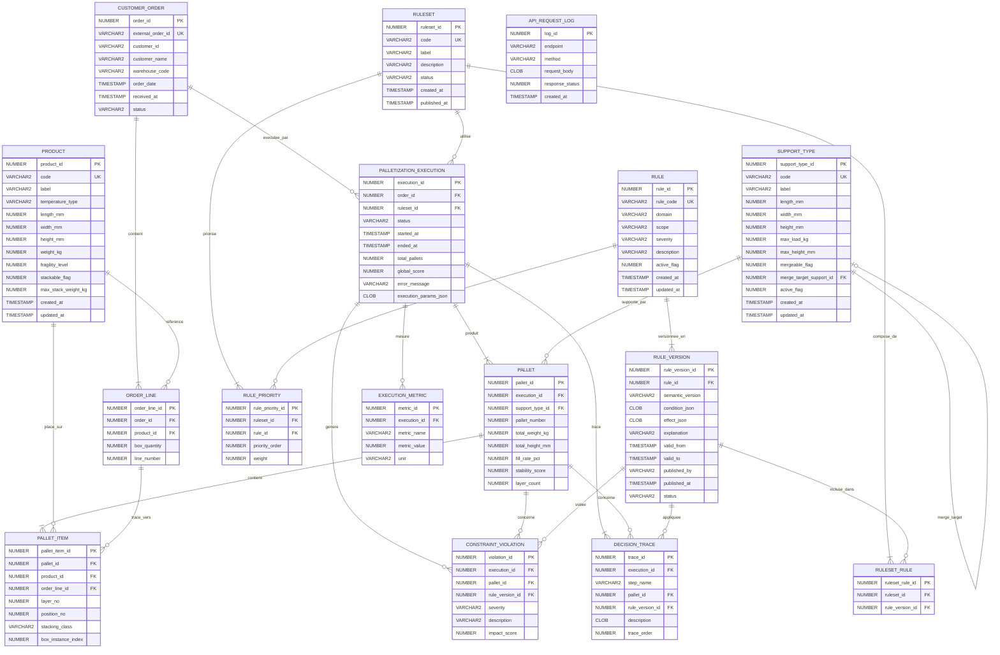

# Modele de Donnees -- MBPal

> **Application** : MBPal -- Construction automatique de palettes
> **Base de donnees** : Oracle (schema a creer)
> **Version du document** : 1.0
> **Date** : 2026-04-02

---

## Table des matieres

1. [Vue d'ensemble](#1-vue-densemble)
2. [Groupes d'entites](#2-groupes-dentités)
   - [2.1 Referentiel metier](#21-referentiel-metier)
   - [2.2 Commandes](#22-commandes)
   - [2.3 Regles](#23-regles)
   - [2.4 Execution](#24-execution)
   - [2.5 Audit](#25-audit)
3. [Diagramme de relations (ERD)](#3-diagramme-de-relations-erd)
4. [Strategie d'indexation](#4-strategie-dindexation)
5. [Strategie de partitionnement](#5-strategie-de-partitionnement)

---

## 1. Vue d'ensemble

Le modele de donnees de MBPal s'organise en **cinq groupes fonctionnels** :

| Groupe | Fonction | Tables |
|--------|----------|--------|
| Referentiel metier | Catalogues produits et supports | `PRODUCT`, `SUPPORT_TYPE` |
| Commandes | Commandes clients et leurs lignes | `CUSTOMER_ORDER`, `ORDER_LINE` |
| Regles | Regles de palettisation versionnees | `RULE`, `RULE_VERSION`, `RULESET`, `RULESET_RULE`, `RULE_PRIORITY` |
| Execution | Resultats de palettisation et tracabilite | `PALLETIZATION_EXECUTION`, `PALLET`, `PALLET_ITEM`, `CONSTRAINT_VIOLATION`, `DECISION_TRACE` |
| Audit | Journalisation des requetes et metriques | `API_REQUEST_LOG`, `EXECUTION_METRIC` |

**Volumetrie estimee** : environ 1 000 commandes par jour, soit environ 365 000 executions par an. Les tables d'execution et d'audit representent le principal vecteur de croissance.

---

## 2. Groupes d'entites

### 2.1 Referentiel metier

Ce groupe contient les donnees de reference stables : le catalogue des produits manipules et le catalogue des supports (palettes, demi-palettes, dollys) sur lesquels les colis sont empiles.

#### PRODUCT

Catalogue des produits. Chaque produit decrit les caracteristiques physiques d'un type de colis.

| Colonne | Type Oracle | Contraintes | Description |
|---------|-------------|-------------|-------------|
| `product_id` | `NUMBER(19)` | `PK` | Identifiant technique |
| `code` | `VARCHAR2(50)` | `NOT NULL, UNIQUE` | Code produit metier |
| `label` | `VARCHAR2(255)` | `NOT NULL` | Libelle du produit |
| `temperature_type` | `VARCHAR2(20)` | `NOT NULL, CHECK IN ('AMBIENT','FRESH','FROZEN')` | Regime de temperature |
| `length_mm` | `NUMBER(10)` | `NOT NULL, > 0` | Longueur du colis en mm |
| `width_mm` | `NUMBER(10)` | `NOT NULL, > 0` | Largeur du colis en mm |
| `height_mm` | `NUMBER(10)` | `NOT NULL, > 0` | Hauteur du colis en mm |
| `weight_kg` | `NUMBER(10,3)` | `NOT NULL, > 0` | Poids d'un colis en kg |
| `fragility_level` | `NUMBER(2)` | `DEFAULT 0, >= 0` | Niveau de fragilite (0 = non fragile) |
| `stackable_flag` | `NUMBER(1)` | `NOT NULL, DEFAULT 1, CHECK IN (0,1)` | Indicateur d'empilabilite |
| `max_stack_weight_kg` | `NUMBER(10,3)` | `NULL` | Poids max supporte au-dessus du colis (kg) |
| `created_at` | `TIMESTAMP` | `NOT NULL, DEFAULT SYSTIMESTAMP` | Date de creation |
| `updated_at` | `TIMESTAMP` | `NOT NULL, DEFAULT SYSTIMESTAMP` | Date de derniere modification |

#### SUPPORT_TYPE

Catalogue des types de supports sur lesquels les colis sont empiles.

| Colonne | Type Oracle | Contraintes | Description |
|---------|-------------|-------------|-------------|
| `support_type_id` | `NUMBER(19)` | `PK` | Identifiant technique |
| `code` | `VARCHAR2(30)` | `NOT NULL, UNIQUE, CHECK IN ('EURO','HALF','DOLLY','CUSTOM')` | Code du type de support |
| `label` | `VARCHAR2(255)` | `NOT NULL` | Libelle |
| `length_mm` | `NUMBER(10)` | `NOT NULL, > 0` | Longueur du support en mm |
| `width_mm` | `NUMBER(10)` | `NOT NULL, > 0` | Largeur du support en mm |
| `height_mm` | `NUMBER(10)` | `NOT NULL, > 0` | Hauteur du support lui-meme en mm |
| `max_load_kg` | `NUMBER(10,3)` | `NOT NULL, > 0` | Charge maximale autorisee en kg |
| `max_height_mm` | `NUMBER(10)` | `NOT NULL, > 0` | Hauteur maximale totale (support + colis) en mm |
| `mergeable_flag` | `NUMBER(1)` | `NOT NULL, DEFAULT 0, CHECK IN (0,1)` | Indique si ce support peut etre fusionne avec un autre |
| `merge_target_support_id` | `NUMBER(19)` | `FK -> SUPPORT_TYPE, NULL` | Support cible en cas de fusion (ex. 2 demi-palettes -> 1 palette) |
| `active_flag` | `NUMBER(1)` | `NOT NULL, DEFAULT 1, CHECK IN (0,1)` | Support actif ou desactive |
| `created_at` | `TIMESTAMP` | `NOT NULL, DEFAULT SYSTIMESTAMP` | Date de creation |
| `updated_at` | `TIMESTAMP` | `NOT NULL, DEFAULT SYSTIMESTAMP` | Date de derniere modification |

> **Note** : `merge_target_support_id` est une cle etrangere auto-referente. Exemple : deux demi-palettes (`HALF`) peuvent etre fusionnees en une palette `EURO`.

---

### 2.2 Commandes

Ce groupe represente les commandes clients recues par le systeme. Chaque commande contient une liste de lignes, chaque ligne correspondant a un produit et a un nombre de colis a palettiser.

#### CUSTOMER_ORDER

En-tete de commande client.

| Colonne | Type Oracle | Contraintes | Description |
|---------|-------------|-------------|-------------|
| `order_id` | `NUMBER(19)` | `PK` | Identifiant technique |
| `external_order_id` | `VARCHAR2(100)` | `NOT NULL, UNIQUE` | Identifiant de la commande dans le systeme source |
| `customer_id` | `VARCHAR2(50)` | `NOT NULL` | Identifiant du client |
| `customer_name` | `VARCHAR2(255)` | `NOT NULL` | Nom du client |
| `warehouse_code` | `VARCHAR2(30)` | `NOT NULL` | Code de l'entrepot concerne |
| `order_date` | `TIMESTAMP` | `NOT NULL` | Date de la commande |
| `received_at` | `TIMESTAMP` | `NOT NULL, DEFAULT SYSTIMESTAMP` | Date de reception dans MBPal |
| `status` | `VARCHAR2(30)` | `NOT NULL, CHECK IN ('RECEIVED','PROCESSING','COMPLETED','ERROR','CANCELLED')` | Statut de la commande |

#### ORDER_LINE

Ligne de commande -- un produit et son nombre de colis.

| Colonne | Type Oracle | Contraintes | Description |
|---------|-------------|-------------|-------------|
| `order_line_id` | `NUMBER(19)` | `PK` | Identifiant technique |
| `order_id` | `NUMBER(19)` | `FK -> CUSTOMER_ORDER, NOT NULL` | Commande parente |
| `product_id` | `NUMBER(19)` | `FK -> PRODUCT, NOT NULL` | Produit concerne |
| `box_quantity` | `NUMBER(10)` | `NOT NULL, > 0` | Nombre de colis a palettiser |
| `line_number` | `NUMBER(5)` | `NOT NULL` | Numero de la ligne dans la commande |

> **Important** : `box_quantity` represente directement le nombre de colis physiques. Il n'y a pas de conversion a effectuer.

---

### 2.3 Regles

Ce groupe modelise le moteur de regles versionnees. Chaque regle possede un historique de versions. Les regles sont regroupees en jeux de regles (`RULESET`) utilises lors de l'execution.

#### RULE

Definition d'une regle metier de palettisation.

| Colonne | Type Oracle | Contraintes | Description |
|---------|-------------|-------------|-------------|
| `rule_id` | `NUMBER(19)` | `PK` | Identifiant technique |
| `rule_code` | `VARCHAR2(50)` | `NOT NULL, UNIQUE` | Code unique de la regle |
| `domain` | `VARCHAR2(50)` | `NOT NULL` | Domaine fonctionnel (ex. `TEMPERATURE`, `WEIGHT`, `STABILITY`) |
| `scope` | `VARCHAR2(30)` | `NOT NULL, CHECK IN ('PACKAGE','PALLET','INTER_PACKAGE')` | Portee de la regle |
| `severity` | `VARCHAR2(10)` | `NOT NULL, CHECK IN ('HARD','SOFT')` | `HARD` = bloquante, `SOFT` = penalisante |
| `description` | `VARCHAR2(2000)` | `NULL` | Description textuelle de la regle |
| `active_flag` | `NUMBER(1)` | `NOT NULL, DEFAULT 1, CHECK IN (0,1)` | Regle active ou non |
| `created_at` | `TIMESTAMP` | `NOT NULL, DEFAULT SYSTIMESTAMP` | Date de creation |
| `updated_at` | `TIMESTAMP` | `NOT NULL, DEFAULT SYSTIMESTAMP` | Date de derniere modification |

#### RULE_VERSION

Version specifique d'une regle. La logique metier (condition + effet) est stockee en JSON dans des CLOB pour garantir la flexibilite et la tracabilite.

| Colonne | Type Oracle | Contraintes | Description |
|---------|-------------|-------------|-------------|
| `rule_version_id` | `NUMBER(19)` | `PK` | Identifiant technique |
| `rule_id` | `NUMBER(19)` | `FK -> RULE, NOT NULL` | Regle parente |
| `semantic_version` | `VARCHAR2(20)` | `NOT NULL` | Version semantique (ex. `1.0.0`, `1.1.0`) |
| `condition_json` | `CLOB` | `NOT NULL` | Condition d'application au format JSON |
| `effect_json` | `CLOB` | `NOT NULL` | Effet / action au format JSON |
| `explanation` | `VARCHAR2(2000)` | `NULL` | Explication humaine du changement |
| `valid_from` | `TIMESTAMP` | `NOT NULL` | Debut de validite |
| `valid_to` | `TIMESTAMP` | `NULL` | Fin de validite (NULL = pas de fin) |
| `published_by` | `VARCHAR2(100)` | `NOT NULL` | Utilisateur ayant publie la version |
| `published_at` | `TIMESTAMP` | `NOT NULL` | Date de publication |
| `status` | `VARCHAR2(20)` | `NOT NULL, CHECK IN ('DRAFT','ACTIVE','ARCHIVED')` | Statut de la version |

> **Contrainte metier** : pour une meme `rule_id`, une seule version peut avoir le statut `ACTIVE` a un instant donne.

#### RULESET

Jeu de regles regroupe un ensemble coherent de versions de regles pour une execution.

| Colonne | Type Oracle | Contraintes | Description |
|---------|-------------|-------------|-------------|
| `ruleset_id` | `NUMBER(19)` | `PK` | Identifiant technique |
| `code` | `VARCHAR2(50)` | `NOT NULL, UNIQUE` | Code du jeu de regles |
| `label` | `VARCHAR2(255)` | `NOT NULL` | Libelle |
| `description` | `VARCHAR2(2000)` | `NULL` | Description |
| `status` | `VARCHAR2(20)` | `NOT NULL, CHECK IN ('DRAFT','ACTIVE','ARCHIVED')` | Statut du jeu |
| `created_at` | `TIMESTAMP` | `NOT NULL, DEFAULT SYSTIMESTAMP` | Date de creation |
| `published_at` | `TIMESTAMP` | `NULL` | Date de publication |

#### RULESET_RULE

Table de liaison N-N entre un jeu de regles et les versions de regles qui le composent.

| Colonne | Type Oracle | Contraintes | Description |
|---------|-------------|-------------|-------------|
| `ruleset_rule_id` | `NUMBER(19)` | `PK` | Identifiant technique |
| `ruleset_id` | `NUMBER(19)` | `FK -> RULESET, NOT NULL` | Jeu de regles |
| `rule_version_id` | `NUMBER(19)` | `FK -> RULE_VERSION, NOT NULL` | Version de regle incluse |

> **Contrainte unique** : `UNIQUE(ruleset_id, rule_version_id)` -- une version de regle n'apparait qu'une seule fois dans un jeu donne.

#### RULE_PRIORITY

Definit l'ordre de priorite et le poids des regles au sein d'un jeu de regles.

| Colonne | Type Oracle | Contraintes | Description |
|---------|-------------|-------------|-------------|
| `rule_priority_id` | `NUMBER(19)` | `PK` | Identifiant technique |
| `ruleset_id` | `NUMBER(19)` | `FK -> RULESET, NOT NULL` | Jeu de regles |
| `rule_id` | `NUMBER(19)` | `FK -> RULE, NOT NULL` | Regle concernee |
| `priority_order` | `NUMBER(5)` | `NOT NULL` | Ordre de priorite (1 = plus prioritaire) |
| `weight` | `NUMBER(5,2)` | `DEFAULT 1.00` | Poids pour le scoring des regles souples (`SOFT`) |

> **Contrainte unique** : `UNIQUE(ruleset_id, rule_id)` -- une regle n'a qu'une seule priorite par jeu.

---

### 2.4 Execution

Ce groupe est le coeur operationnel du systeme. Il persiste les resultats de chaque execution de palettisation, le detail du placement de chaque colis, les violations de contraintes et la trace complete des decisions prises par l'algorithme.

#### PALLETIZATION_EXECUTION

Execution d'une palettisation pour une commande donnee.

| Colonne | Type Oracle | Contraintes | Description |
|---------|-------------|-------------|-------------|
| `execution_id` | `NUMBER(19)` | `PK` | Identifiant technique |
| `order_id` | `NUMBER(19)` | `FK -> CUSTOMER_ORDER, NOT NULL` | Commande traitee |
| `ruleset_id` | `NUMBER(19)` | `FK -> RULESET, NOT NULL` | Jeu de regles utilise |
| `status` | `VARCHAR2(20)` | `NOT NULL, CHECK IN ('PENDING','PROCESSING','COMPLETED','ERROR')` | Statut de l'execution |
| `started_at` | `TIMESTAMP` | `NULL` | Debut de l'execution |
| `ended_at` | `TIMESTAMP` | `NULL` | Fin de l'execution |
| `total_pallets` | `NUMBER(5)` | `NULL` | Nombre total de palettes generees |
| `global_score` | `NUMBER(7,4)` | `NULL` | Score global de qualite de la palettisation |
| `error_message` | `VARCHAR2(4000)` | `NULL` | Message d'erreur le cas echeant |
| `execution_params_json` | `CLOB` | `NULL` | Parametres d'execution au format JSON |

#### PALLET

Palette construite lors d'une execution.

| Colonne | Type Oracle | Contraintes | Description |
|---------|-------------|-------------|-------------|
| `pallet_id` | `NUMBER(19)` | `PK` | Identifiant technique |
| `execution_id` | `NUMBER(19)` | `FK -> PALLETIZATION_EXECUTION, NOT NULL` | Execution parente |
| `support_type_id` | `NUMBER(19)` | `FK -> SUPPORT_TYPE, NOT NULL` | Type de support utilise |
| `pallet_number` | `NUMBER(5)` | `NOT NULL` | Numero de la palette dans l'execution |
| `total_weight_kg` | `NUMBER(10,3)` | `NOT NULL` | Poids total charge sur la palette en kg |
| `total_height_mm` | `NUMBER(10)` | `NOT NULL` | Hauteur totale (support + colis) en mm |
| `fill_rate_pct` | `NUMBER(5,2)` | `NOT NULL` | Taux de remplissage en % |
| `stability_score` | `NUMBER(5,2)` | `NULL` | Score de stabilite |
| `layer_count` | `NUMBER(3)` | `NOT NULL` | Nombre de couches |

#### PALLET_ITEM

Positionnement individuel de chaque colis sur une palette.

| Colonne | Type Oracle | Contraintes | Description |
|---------|-------------|-------------|-------------|
| `pallet_item_id` | `NUMBER(19)` | `PK` | Identifiant technique |
| `pallet_id` | `NUMBER(19)` | `FK -> PALLET, NOT NULL` | Palette d'affectation |
| `product_id` | `NUMBER(19)` | `FK -> PRODUCT, NOT NULL` | Produit place |
| `order_line_id` | `NUMBER(19)` | `FK -> ORDER_LINE, NOT NULL` | Ligne de commande d'origine |
| `layer_no` | `NUMBER(3)` | `NOT NULL` | Numero de couche (1 = bas) |
| `position_no` | `NUMBER(5)` | `NOT NULL` | Position dans la couche |
| `stacking_class` | `VARCHAR2(30)` | `NULL` | Classe d'empilement |
| `box_instance_index` | `NUMBER(10)` | `NOT NULL` | Index du colis parmi la quantite de la ligne |

> **Tracabilite complete** : chaque colis physique (`box_instance_index`) d'une ligne de commande est tracable individuellement sur sa palette, sa couche et sa position.

#### CONSTRAINT_VIOLATION

Violations de contraintes detectees lors de l'execution.

| Colonne | Type Oracle | Contraintes | Description |
|---------|-------------|-------------|-------------|
| `violation_id` | `NUMBER(19)` | `PK` | Identifiant technique |
| `execution_id` | `NUMBER(19)` | `FK -> PALLETIZATION_EXECUTION, NOT NULL` | Execution concernee |
| `pallet_id` | `NUMBER(19)` | `FK -> PALLET, NULL` | Palette concernee (NULL si violation globale) |
| `rule_version_id` | `NUMBER(19)` | `FK -> RULE_VERSION, NOT NULL` | Version de la regle violee |
| `severity` | `VARCHAR2(10)` | `NOT NULL, CHECK IN ('HARD','SOFT')` | Severite de la violation |
| `description` | `VARCHAR2(4000)` | `NOT NULL` | Description de la violation |
| `impact_score` | `NUMBER(7,4)` | `NULL` | Score d'impact sur la qualite |

#### DECISION_TRACE

Trace detaillee de chaque etape de decision de l'algorithme de palettisation. Permet une tracabilite complete et le diagnostic post-execution.

| Colonne | Type Oracle | Contraintes | Description |
|---------|-------------|-------------|-------------|
| `trace_id` | `NUMBER(19)` | `PK` | Identifiant technique |
| `execution_id` | `NUMBER(19)` | `FK -> PALLETIZATION_EXECUTION, NOT NULL` | Execution concernee |
| `step_name` | `VARCHAR2(100)` | `NOT NULL` | Nom de l'etape (ex. `INIT`, `LAYER_BUILD`, `PALLET_CLOSE`) |
| `pallet_id` | `NUMBER(19)` | `FK -> PALLET, NULL` | Palette concernee (si applicable) |
| `rule_version_id` | `NUMBER(19)` | `FK -> RULE_VERSION, NULL` | Version de regle appliquee (si applicable) |
| `description` | `CLOB` | `NOT NULL` | Description detaillee de la decision |
| `trace_order` | `NUMBER(10)` | `NOT NULL` | Ordre sequentiel de la trace dans l'execution |

---

### 2.5 Audit

Ce groupe assure la journalisation des appels API et la collecte de metriques operationnelles.

#### API_REQUEST_LOG

Journal de toutes les requetes API recues par le systeme.

| Colonne | Type Oracle | Contraintes | Description |
|---------|-------------|-------------|-------------|
| `log_id` | `NUMBER(19)` | `PK` | Identifiant technique |
| `endpoint` | `VARCHAR2(500)` | `NOT NULL` | Point de terminaison appele |
| `method` | `VARCHAR2(10)` | `NOT NULL` | Methode HTTP (`GET`, `POST`, etc.) |
| `request_body` | `CLOB` | `NULL` | Corps de la requete |
| `response_status` | `NUMBER(3)` | `NOT NULL` | Code de statut HTTP de la reponse |
| `created_at` | `TIMESTAMP` | `NOT NULL, DEFAULT SYSTIMESTAMP` | Date de la requete |

#### EXECUTION_METRIC

Metriques de performance et de qualite collectees par execution.

| Colonne | Type Oracle | Contraintes | Description |
|---------|-------------|-------------|-------------|
| `metric_id` | `NUMBER(19)` | `PK` | Identifiant technique |
| `execution_id` | `NUMBER(19)` | `FK -> PALLETIZATION_EXECUTION, NOT NULL` | Execution concernee |
| `metric_name` | `VARCHAR2(100)` | `NOT NULL` | Nom de la metrique (ex. `duration_ms`, `avg_fill_rate`) |
| `metric_value` | `NUMBER(15,4)` | `NOT NULL` | Valeur de la metrique |
| `unit` | `VARCHAR2(30)` | `NULL` | Unite de mesure |

---

## 3. Diagramme de relations (ERD)



---

## 4. Strategie d'indexation

### Index primaires (crees automatiquement par les PKs)

Tous les champs `*_id` en cle primaire disposent d'un index unique implicite.

### Index secondaires recommandes

| Table | Index | Colonnes | Justification |
|-------|-------|----------|---------------|
| `PRODUCT` | `IDX_PRODUCT_TEMP_TYPE` | `temperature_type` | Filtrage frequent par regime de temperature |
| `CUSTOMER_ORDER` | `IDX_ORDER_STATUS` | `status` | Recherche des commandes par statut |
| `CUSTOMER_ORDER` | `IDX_ORDER_CUSTOMER` | `customer_id` | Recherche par client |
| `CUSTOMER_ORDER` | `IDX_ORDER_RECEIVED` | `received_at` | Requetes temporelles, purge |
| `ORDER_LINE` | `IDX_OL_ORDER` | `order_id` | Jointure commande -> lignes |
| `ORDER_LINE` | `IDX_OL_PRODUCT` | `product_id` | Jointure produit -> lignes |
| `RULE_VERSION` | `IDX_RV_RULE_STATUS` | `rule_id, status` | Recherche de la version active d'une regle |
| `RULESET_RULE` | `IDX_RSR_RULESET` | `ruleset_id` | Jointure jeu -> versions de regles |
| `RULESET_RULE` | `IDX_RSR_RULEVERSION` | `rule_version_id` | Jointure inverse |
| `PALLETIZATION_EXECUTION` | `IDX_EXEC_ORDER` | `order_id` | Recherche des executions d'une commande |
| `PALLETIZATION_EXECUTION` | `IDX_EXEC_STATUS` | `status` | Supervision des executions en cours |
| `PALLETIZATION_EXECUTION` | `IDX_EXEC_STARTED` | `started_at` | Requetes temporelles, partitionnement |
| `PALLET` | `IDX_PAL_EXEC` | `execution_id` | Jointure execution -> palettes |
| `PALLET_ITEM` | `IDX_PI_PALLET` | `pallet_id` | Jointure palette -> items |
| `PALLET_ITEM` | `IDX_PI_ORDERLINE` | `order_line_id` | Tracabilite ligne -> colis |
| `CONSTRAINT_VIOLATION` | `IDX_CV_EXEC` | `execution_id` | Violations par execution |
| `DECISION_TRACE` | `IDX_DT_EXEC_ORDER` | `execution_id, trace_order` | Lecture sequentielle des traces |
| `API_REQUEST_LOG` | `IDX_ARL_CREATED` | `created_at` | Recherche temporelle, purge |
| `EXECUTION_METRIC` | `IDX_EM_EXEC` | `execution_id` | Metriques par execution |

### Index fonctionnels

```sql
-- Recherche rapide de la version active d'une regle
CREATE INDEX IDX_RV_ACTIVE ON RULE_VERSION (rule_id)
    WHERE status = 'ACTIVE';
```

> **Note** : Oracle ne supporte pas directement les index filtres (`WHERE`). Utiliser a la place un index base sur fonction ou un index bitmap selon les cardinalites.

---

## 5. Strategie de partitionnement

Avec un volume de ~1 000 commandes par jour, les tables d'execution et d'audit sont les principales candidates au partitionnement.

### Tables partitionnees

| Table | Strategie | Cle | Frequence | Justification |
|-------|-----------|-----|-----------|---------------|
| `PALLETIZATION_EXECUTION` | `RANGE` | `started_at` | Mensuelle | ~30 000 lignes/mois ; les requetes portent generalement sur des periodes recentes |
| `PALLET` | `RANGE` par reference | `execution_id` | Mensuelle | Herite du partitionnement de l'execution parente via `REF PARTITIONING` |
| `PALLET_ITEM` | `RANGE` par reference | `pallet_id` | Mensuelle | Herite du partitionnement de la palette parente |
| `CONSTRAINT_VIOLATION` | `RANGE` par reference | `execution_id` | Mensuelle | Herite du partitionnement de l'execution |
| `DECISION_TRACE` | `RANGE` par reference | `execution_id` | Mensuelle | Table a forte volumetrie (nombreuses traces par execution) |
| `API_REQUEST_LOG` | `RANGE` | `created_at` | Mensuelle | Volume important, purge facilitee |
| `EXECUTION_METRIC` | `RANGE` par reference | `execution_id` | Mensuelle | Herite du partitionnement de l'execution |

### Exemple de creation partitionnee

```sql
CREATE TABLE PALLETIZATION_EXECUTION (
    execution_id    NUMBER(19)    NOT NULL,
    order_id        NUMBER(19)    NOT NULL,
    ruleset_id      NUMBER(19)    NOT NULL,
    status          VARCHAR2(20)  NOT NULL,
    started_at      TIMESTAMP,
    ended_at        TIMESTAMP,
    total_pallets   NUMBER(5),
    global_score    NUMBER(7,4),
    error_message   VARCHAR2(4000),
    execution_params_json CLOB,
    CONSTRAINT pk_execution PRIMARY KEY (execution_id),
    CONSTRAINT fk_exec_order FOREIGN KEY (order_id) REFERENCES CUSTOMER_ORDER(order_id),
    CONSTRAINT fk_exec_ruleset FOREIGN KEY (ruleset_id) REFERENCES RULESET(ruleset_id),
    CONSTRAINT chk_exec_status CHECK (status IN ('PENDING','PROCESSING','COMPLETED','ERROR'))
)
PARTITION BY RANGE (started_at)
INTERVAL (NUMTOYMINTERVAL(1, 'MONTH'))
(
    PARTITION p_initial VALUES LESS THAN (TIMESTAMP '2026-01-01 00:00:00')
);
```

### Politique de retention

| Table | Retention en ligne | Archivage |
|-------|--------------------|-----------|
| `PALLETIZATION_EXECUTION` et tables filles | 12 mois | Export vers stockage froid (Oracle Data Pump) |
| `API_REQUEST_LOG` | 6 mois | Purge avec `ALTER TABLE ... DROP PARTITION` |
| `DECISION_TRACE` | 6 mois | Export puis purge |
| Tables referentiel et regles | Illimitee | Pas de purge (historique versionne) |

> **Avantage du partitionnement par intervalle** : les nouvelles partitions sont creees automatiquement par Oracle lors de l'insertion de donnees depassant la borne superieure de la derniere partition existante. Aucune maintenance manuelle n'est requise.

---

## Annexe : Conventions de nommage

| Element | Convention | Exemple |
|---------|------------|---------|
| Table | `UPPER_SNAKE_CASE` | `CUSTOMER_ORDER` |
| Colonne | `lower_snake_case` | `order_id` |
| Cle primaire | `pk_<table>` | `pk_customer_order` |
| Cle etrangere | `fk_<table_source>_<table_cible>` | `fk_ol_order` |
| Index | `IDX_<table_abrev>_<colonnes>` | `IDX_EXEC_STATUS` |
| Contrainte CHECK | `chk_<table>_<colonne>` | `chk_exec_status` |
| Sequence | `SEQ_<table>` | `SEQ_CUSTOMER_ORDER` |
| Partition | `p_<description>` | `p_initial`, `p_202604` |
