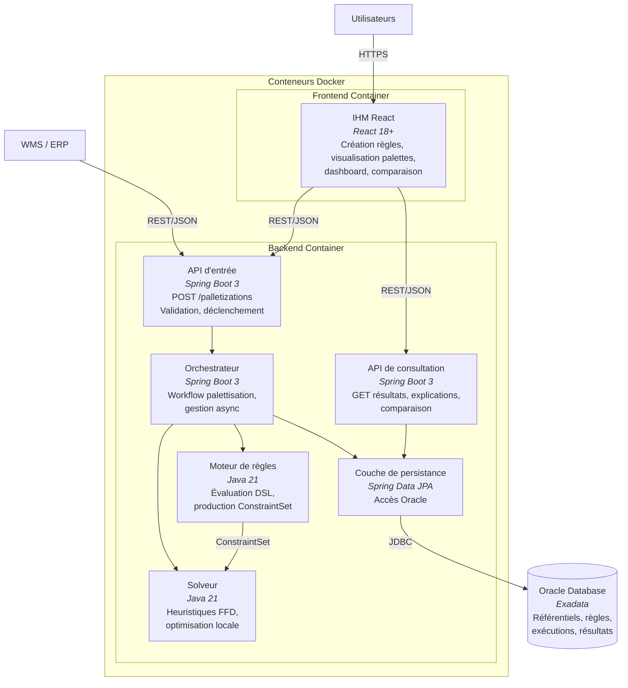

# Diagramme C4 — Niveau Conteneurs

## Architecture des conteneurs applicatifs

## Description des conteneurs

| Conteneur | Technologie | Responsabilité |
|-----------|-------------|----------------|
| **IHM React** | React 18+ | Interface utilisateur : création de règles par formulaires, visualisation des palettes, dashboard, comparaison d'exécutions |
| **API d'entrée** | Spring Boot 3 | Réception des commandes, validation du format, déclenchement asynchrone du calcul |
| **Orchestrateur** | Spring Boot 3 | Pilotage du workflow : préparation → règles → solveur → validation → persistance |
| **Moteur de règles** | Java 21 | Chargement et évaluation du DSL de règles, production du ConstraintSet |
| **Solveur** | Java 21 | Calcul de la palettisation par heuristiques (FFD + amélioration locale) |
| **API de consultation** | Spring Boot 3 | Restitution des résultats, historique, explications, comparaison |
| **Couche de persistance** | Spring Data JPA | Accès unifié à la base Oracle |
| **Oracle Database** | Oracle Exadata | Stockage central : référentiels, règles versionnées, exécutions, palettes, traces |
