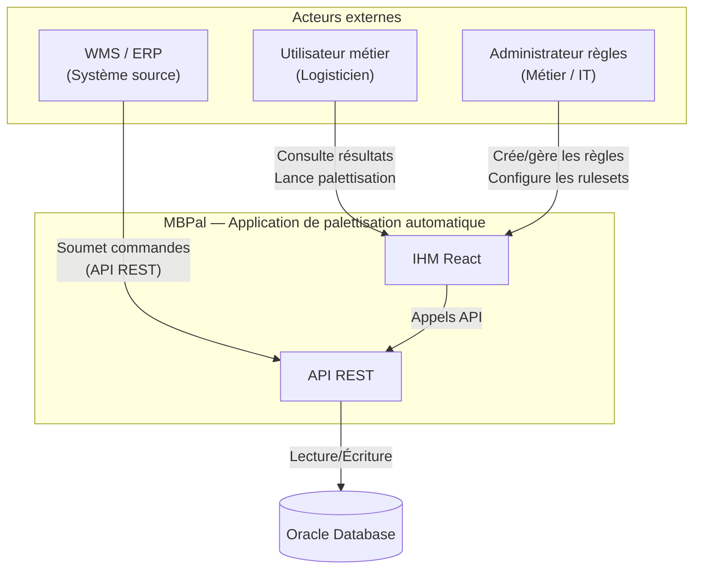

# Diagramme C4 — Niveau Contexte

## Vue d'ensemble du système MBPal et ses interactions

## Description

| Élément | Rôle |
|---------|------|
| **WMS / ERP** | Système source qui soumet les commandes à palettiser via l'API REST |
| **Utilisateur métier** | Logisticien qui lance les palettisations et consulte les résultats via l'IHM |
| **Administrateur règles** | Utilisateur métier ou IT qui crée, modifie et priorise les règles de palettisation |
| **MBPal** | Application de calcul automatique de palettes |
| **Oracle Database** | Base de données centrale stockant référentiels, règles, exécutions et résultats |
