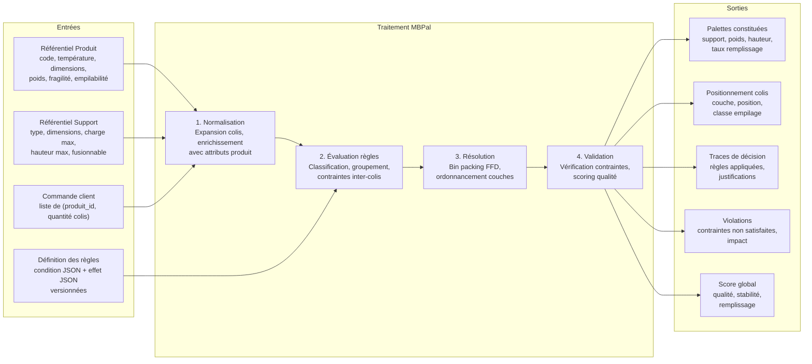
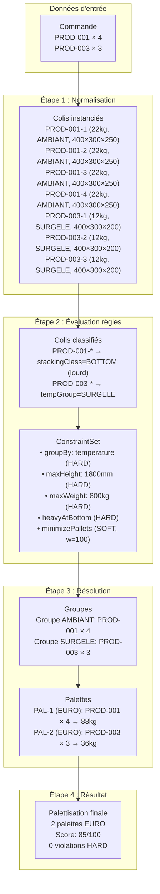
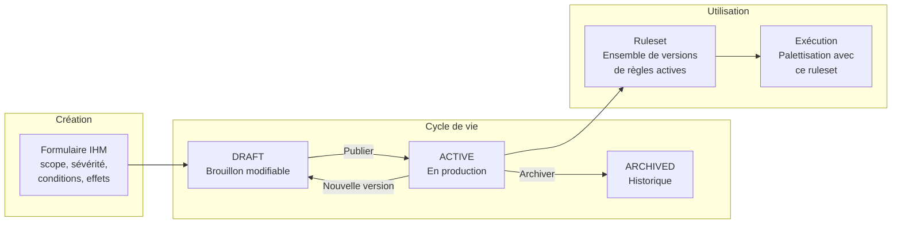

# Diagramme de flux de données

## Flux global de données dans MBPal

```mermaid
flowchart LR
    subgraph Entrées
        REF_PROD["Référentiel Produit<br/>code, température, dimensions,<br/>poids, fragilité, empilabilité"]
        REF_SUP["Référentiel Support<br/>type, dimensions, charge max,<br/>hauteur max, fusionnable"]
        CMD["Commande client<br/>liste de (produit_id, quantité colis)"]
        RULES_DEF["Définition des règles<br/>condition JSON + effet JSON<br/>versionnées"]
    end

    subgraph Traitement["Traitement MBPal"]
        direction TB
        NORM["1. Normalisation<br/>Expansion colis, enrichissement<br/>avec attributs produit"]
        EVAL["2. Évaluation règles<br/>Classification, groupement,<br/>contraintes inter-colis"]
        SOLVE["3. Résolution<br/>Bin packing FFD,<br/>ordonnancement couches"]
        VALID["4. Validation<br/>Vérification contraintes,<br/>scoring qualité"]
        
        NORM --> EVAL --> SOLVE --> VALID
    end

    subgraph Sorties
        PALETTES["Palettes constituées<br/>support, poids, hauteur,<br/>taux remplissage"]
        ITEMS["Positionnement colis<br/>couche, position,<br/>classe empilage"]
        TRACES["Traces de décision<br/>règles appliquées,<br/>justifications"]
        VIOLATIONS["Violations<br/>contraintes non satisfaites,<br/>impact"]
        SCORE["Score global<br/>qualité, stabilité,<br/>remplissage"]
    end

    REF_PROD --> NORM
    REF_SUP --> NORM
    CMD --> NORM
    RULES_DEF --> EVAL

    VALID --> PALETTES
    VALID --> ITEMS
    VALID --> TRACES
    VALID --> VIOLATIONS
    VALID --> SCORE
```

## Flux de transformation des données

```mermaid
flowchart TB
    subgraph input["Données d'entrée"]
        ORDER["Commande<br/>PROD-001 × 4<br/>PROD-003 × 3"]
    end

    subgraph step1["Étape 1 : Normalisation"]
        BOXES["Colis instanciés<br/>PROD-001-1 (22kg, AMBIANT, 400×300×250)<br/>PROD-001-2 (22kg, AMBIANT, 400×300×250)<br/>PROD-001-3 (22kg, AMBIANT, 400×300×250)<br/>PROD-001-4 (22kg, AMBIANT, 400×300×250)<br/>PROD-003-1 (12kg, SURGELE, 400×300×200)<br/>PROD-003-2 (12kg, SURGELE, 400×300×200)<br/>PROD-003-3 (12kg, SURGELE, 400×300×200)"]
    end

    subgraph step2["Étape 2 : Évaluation règles"]
        CLASSIFIED["Colis classifiés<br/>PROD-001-* → stackingClass=BOTTOM (lourd)<br/>PROD-003-* → tempGroup=SURGELE"]
        CONSTRAINTS["ConstraintSet<br/>• groupBy: temperature (HARD)<br/>• maxHeight: 1800mm (HARD)<br/>• maxWeight: 800kg (HARD)<br/>• heavyAtBottom (HARD)<br/>• minimizePallets (SOFT, w=100)"]
    end

    subgraph step3["Étape 3 : Résolution"]
        GROUPS["Groupes<br/>Groupe AMBIANT: PROD-001 × 4<br/>Groupe SURGELE: PROD-003 × 3"]
        PALLETS["Palettes<br/>PAL-1 (EURO): PROD-001 × 4 → 88kg<br/>PAL-2 (EURO): PROD-003 × 3 → 36kg"]
    end

    subgraph step4["Étape 4 : Résultat"]
        RESULT["Palettisation finale<br/>2 palettes EURO<br/>Score: 85/100<br/>0 violations HARD"]
    end

    ORDER --> BOXES --> CLASSIFIED
    CLASSIFIED --> CONSTRAINTS
    CONSTRAINTS --> GROUPS --> PALLETS --> RESULT
```

## Flux de gestion des règles

```mermaid
flowchart LR
    subgraph creation["Création"]
        FORM["Formulaire IHM<br/>scope, sévérité,<br/>conditions, effets"]
    end

    subgraph lifecycle["Cycle de vie"]
        DRAFT["DRAFT<br/>Brouillon modifiable"]
        ACTIVE["ACTIVE<br/>En production"]
        ARCHIVED["ARCHIVED<br/>Historique"]
        
        DRAFT -->|"Publier"| ACTIVE
        ACTIVE -->|"Archiver"| ARCHIVED
        ACTIVE -->|"Nouvelle version"| DRAFT
    end

    subgraph usage["Utilisation"]
        RSET["Ruleset<br/>Ensemble de versions<br/>de règles actives"]
        EXEC["Exécution<br/>Palettisation avec<br/>ce ruleset"]
    end

    FORM --> DRAFT
    ACTIVE --> RSET
    RSET --> EXEC
```
