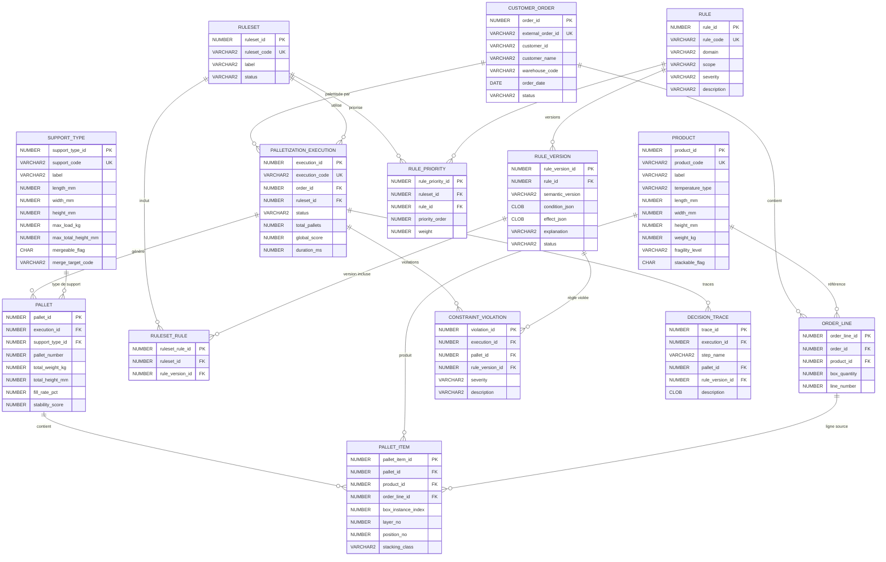

# Diagramme du modèle de données

## Modèle entité-relation

## Groupes d'entités

| Groupe | Tables | Description |
|--------|--------|-------------|
| **Référentiel** | PRODUCT, SUPPORT_TYPE | Données de référence stables |
| **Commande** | CUSTOMER_ORDER, ORDER_LINE | Commandes client soumises |
| **Règles** | RULE, RULE_VERSION, RULESET, RULESET_RULE, RULE_PRIORITY | Moteur de règles versionné |
| **Exécution** | PALLETIZATION_EXECUTION, PALLET, PALLET_ITEM, CONSTRAINT_VIOLATION, DECISION_TRACE | Résultats de palettisation |
| **Audit** | API_REQUEST_LOG, EXECUTION_METRIC | Journalisation et métriques |
