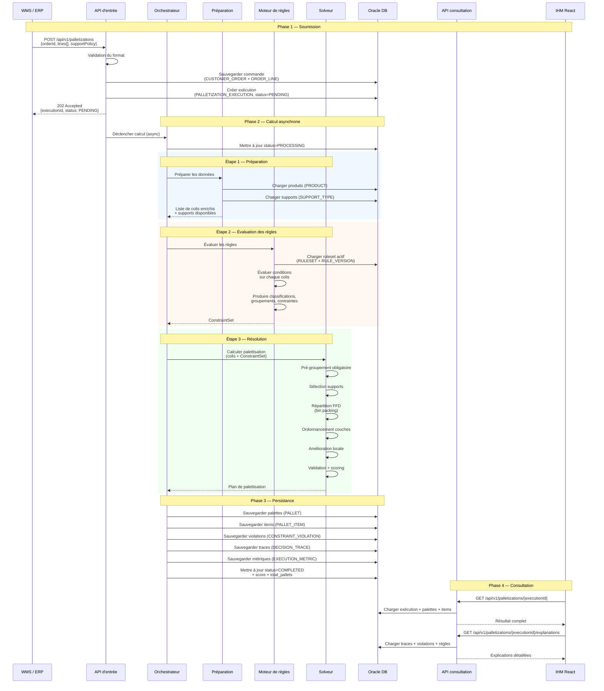
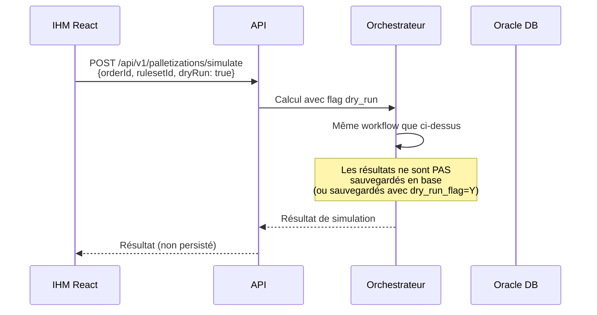
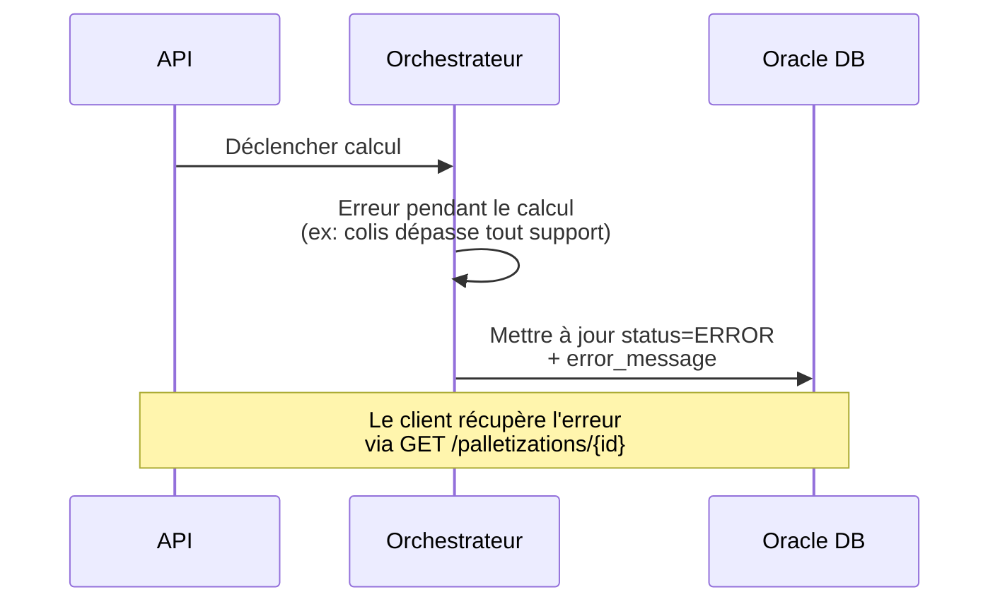

# Diagramme de séquence — Calcul de palettisation

## Flux principal : soumission et calcul d'une commande

```mermaid
sequenceDiagram
    participant WMS as WMS / ERP
    participant API as API d'entrée
    participant ORCH as Orchestrateur
    participant PREP as Préparation
    participant RULES as Moteur de règles
    participant SOLVER as Solveur
    participant DB as Oracle DB
    participant APIC as API consultation
    participant UI as IHM React

    Note over WMS,UI: Phase 1 — Soumission

    WMS->>API: POST /api/v1/palletizations<br/>{orderId, lines[], supportPolicy}
    API->>API: Validation du format
    API->>DB: Sauvegarder commande<br/>(CUSTOMER_ORDER + ORDER_LINE)
    API->>DB: Créer exécution<br/>(PALLETIZATION_EXECUTION, status=PENDING)
    API-->>WMS: 202 Accepted<br/>{executionId, status: PENDING}

    Note over ORCH,DB: Phase 2 — Calcul asynchrone

    API->>ORCH: Déclencher calcul (async)
    ORCH->>DB: Mettre à jour status=PROCESSING
    
    rect rgb(240, 248, 255)
        Note over ORCH,SOLVER: Étape 1 — Préparation
        ORCH->>PREP: Préparer les données
        PREP->>DB: Charger produits (PRODUCT)
        PREP->>DB: Charger supports (SUPPORT_TYPE)
        PREP-->>ORCH: Liste de colis enrichis<br/>+ supports disponibles
    end

    rect rgb(255, 248, 240)
        Note over ORCH,SOLVER: Étape 2 — Évaluation des règles
        ORCH->>RULES: Évaluer les règles
        RULES->>DB: Charger ruleset actif<br/>(RULESET + RULE_VERSION)
        RULES->>RULES: Évaluer conditions<br/>sur chaque colis
        RULES->>RULES: Produire classifications,<br/>groupements, contraintes
        RULES-->>ORCH: ConstraintSet
    end

    rect rgb(240, 255, 240)
        Note over ORCH,SOLVER: Étape 3 — Résolution
        ORCH->>SOLVER: Calculer palettisation<br/>(colis + ConstraintSet)
        SOLVER->>SOLVER: Pré-groupement obligatoire
        SOLVER->>SOLVER: Sélection supports
        SOLVER->>SOLVER: Répartition FFD<br/>(bin packing)
        SOLVER->>SOLVER: Ordonnancement couches
        SOLVER->>SOLVER: Amélioration locale
        SOLVER->>SOLVER: Validation + scoring
        SOLVER-->>ORCH: Plan de palettisation
    end

    Note over ORCH,DB: Phase 3 — Persistance

    ORCH->>DB: Sauvegarder palettes (PALLET)
    ORCH->>DB: Sauvegarder items (PALLET_ITEM)
    ORCH->>DB: Sauvegarder violations (CONSTRAINT_VIOLATION)
    ORCH->>DB: Sauvegarder traces (DECISION_TRACE)
    ORCH->>DB: Sauvegarder métriques (EXECUTION_METRIC)
    ORCH->>DB: Mettre à jour status=COMPLETED<br/>+ score + total_pallets

    Note over UI,APIC: Phase 4 — Consultation

    UI->>APIC: GET /api/v1/palletizations/{executionId}
    APIC->>DB: Charger exécution + palettes + items
    APIC-->>UI: Résultat complet
    
    UI->>APIC: GET /api/v1/palletizations/{executionId}/explanations
    APIC->>DB: Charger traces + violations + règles
    APIC-->>UI: Explications détaillées
```

## Flux alternatif : simulation (dry run)

```mermaid
sequenceDiagram
    participant UI as IHM React
    participant API as API
    participant ORCH as Orchestrateur
    participant DB as Oracle DB

    UI->>API: POST /api/v1/palletizations/simulate<br/>{orderId, rulesetId, dryRun: true}
    API->>ORCH: Calcul avec flag dry_run
    ORCH->>ORCH: Même workflow que ci-dessus
    Note over ORCH: Les résultats ne sont PAS<br/>sauvegardés en base<br/>(ou sauvegardés avec dry_run_flag=Y)
    ORCH-->>API: Résultat de simulation
    API-->>UI: Résultat (non persisté)
```

## Flux alternatif : erreur

```mermaid
sequenceDiagram
    participant API as API
    participant ORCH as Orchestrateur
    participant DB as Oracle DB

    API->>ORCH: Déclencher calcul
    ORCH->>ORCH: Erreur pendant le calcul<br/>(ex: colis dépasse tout support)
    ORCH->>DB: Mettre à jour status=ERROR<br/>+ error_message
    
    Note over API,DB: Le client récupère l'erreur<br/>via GET /palletizations/{id}
```
